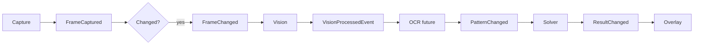

# GuessWord AI — Architecture

## Overview

GuessWord AI is a pipeline of single-responsibility modules. Data flows through an **event bus** so OCR and solving run only when inputs change.



Capture publishes `FrameChanged`; vision publishes `VisionProcessedEvent`; OCR runs on a single worker and publishes `PatternChangedEvent`; the solver publishes ranked `ResultChangedEvent` candidates. The overlay bridges worker events to the Qt UI thread.

## Module boundaries

| Module | Input | Output | Must not |
|--------|--------|--------|----------|
| `capture` | Monitor region (from config) | BGR frame + `CaptureProvider` (MSS on X11, Qt ScreenCast on Wayland) | OCR, solving |
| `vision` | Raw BGR frame | `VisionProcessResult` (grayscale, threshold, processed) | OCR, dictionary, UI |
| `ocr` | Preprocessed image | `{pattern, confidence}` | Capture, ranking |
| `solver` | Pattern string | Ranked `{word, score}` list | Screen I/O |
| `overlay` | Pattern and top guesses | On-screen UI | Capture, OCR |
| `config` | Files, env | Immutable settings objects | Business logic |
| `utils` | — | Cross-cutting helpers (logging) | Domain logic |

## Configuration

- **Single entry point:** `config.settings.load_settings()` returns a frozen `AppSettings` tree.
- **Sources (later overrides earlier):** built-in defaults → optional TOML file → `GUESSWORD_*` environment variables.
- All runtime modules receive settings via constructor or explicit arguments (no import-time globals).

## Logging

- **Single setup:** `utils.logging_config.configure_logging(settings.logging)` once from `main.py`.
- Library code uses `logging.getLogger(__name__)`.
- Log level and file path come from settings.

## Performance target (Phase 7)

- Change detection on frames to skip redundant OCR.
- Dictionary loaded once and indexed by pattern length / prefix.
- OCR and solver may run on worker threads; overlay updates on the UI thread only.

## Repository layout

```
GuessTheWord/
├── main.py                 # Entry: Qt capture loop, vision stage, debug preview
├── config/default.toml     # Example user config (optional)
├── src/
│   ├── capture/            # MSS provider, region picker, adaptive loop
│   ├── core/               # EventBus, CapturePipeline, shared events
│   ├── debug/              # Capture / vision debug preview
│   ├── vision/             # Image preprocessing (Phase 3+)
│   ├── ocr/                # OCR protocols (Phase 4+)
│   ├── solver/             # Dictionary protocols (Phase 5+)
│   ├── overlay/            # Prediction UI (Phase 6+)
│   ├── config/             # settings.py, persist.py
│   └── utils/              # logging_config.py, metrics.py
└── tests/
```

## Import convention

Run from project root with `src` on `PYTHONPATH` (see `main.py`). Phase 2+ modules will use absolute imports from the package root, e.g. `from config.settings import AppSettings`.
