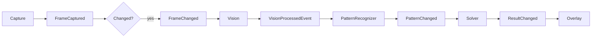

# GuessWord AI — Architecture

## Overview

GuessWord AI is a pipeline of single-responsibility modules. Data flows through an **event bus** so OCR and solving run only when inputs change.



Phase 2 implements capture through `FrameChanged`. Phase 3 adds vision on `FrameChanged` and publishes `VisionProcessedEvent` (no OCR).

## Module boundaries

| Module | Input | Output | Must not |
|--------|--------|--------|----------|
| `capture` | Monitor region (from config) | BGR frame + `CaptureProvider` | OCR, solving |
| `vision` | Raw BGR frame | `VisionProcessResult` (grayscale, threshold, processed) | OCR, dictionary, UI |
| `ocr` | `VisionProcessResult` | `{pattern, confidence}` via letter OCR + blank CV + normalizer | Capture, ranking |
| `solver` | Pattern string | Ranked `{word, score}` list | Screen I/O |
| `overlay` | Top guesses | On-screen UI | Capture, OCR |
| `config` | Files, env | Immutable settings objects | Business logic |
| `utils` | — | Cross-cutting helpers (logging) | Domain logic |

## Configuration

- **Single entry point:** `config.settings.load_settings()` returns a frozen `AppSettings` tree.
- **Sources (later overrides earlier):** built-in defaults → optional TOML file → `GUESSWORD_*` environment variables.
- All runtime modules receive settings via constructor or explicit arguments (no import-time globals).

## Logging

- **Single setup:** `utils.logging_config.configure_logging(settings.logging)` once from `main.py`.
- Library code uses `logging.getLogger(__name__)`.
- Log level and file path come from settings.

## Performance target (Phase 7)

- Change detection on frames to skip redundant OCR.
- Dictionary loaded once and indexed by pattern length / prefix.
- OCR and solver may run on worker threads; overlay updates on the UI thread only.

## Repository layout

```
GuessTheWord/
├── main.py                 # Entry: Qt capture loop, vision stage, debug preview
├── config/default.toml     # Example user config (optional)
├── src/
│   ├── capture/            # MSS provider, region picker, adaptive loop
│   ├── core/               # EventBus, CapturePipeline, shared events
│   ├── debug/              # Capture / vision debug preview
│   ├── vision/             # Image preprocessing (Phase 3+)
│   ├── ocr/                # Pattern pipeline, engines/ (Phase 4+)
│   ├── solver/             # Dictionary protocols (Phase 5+)
│   ├── overlay/            # Prediction UI (Phase 6+)
│   ├── config/             # settings.py, persist.py
│   └── utils/              # logging_config.py, metrics.py
└── tests/
```

## Import convention

Run from project root with `src` on `PYTHONPATH` (see `main.py`). Phase 2+ modules will use absolute imports from the package root, e.g. `from config.settings import AppSettings`.

## OCR and pattern recognition (Phase 4)

Vision publishes **`VisionProcessedEvent`** with stage images; OCR must not reimplement preprocessing.

Recognition is **two-path**, then merged:

1. **Letter OCR** (`src/ocr/engines/*`) — alphabetic characters only from a color or grayscale crop (default: original BGR).
2. **Blank detection** (`blank_detector.py`) — underscore / slot count from the **processed binary** image.
3. **PatternNormalizer** — `letters + blanks → pattern` (e.g. `to` + `_____` → `to_____`).

`PatternRecognizer` is the facade used by both the future **`OCRStage`** (event bus) and the standalone **`tools/ocr_validate`** benchmark (no bus).

Engine selection uses a labeled dataset of **50–100+** images (`benchmarks/ocr_dataset/`), not a single fixture. See [docs/OCR_PHASE4_DESIGN.md](docs/OCR_PHASE4_DESIGN.md).

```
benchmarks/ocr_dataset/     # dataset.json + images/ (benchmark corpus)
tools/ocr_validate/       # CLI benchmark; imports src/ocr only
src/ocr/
  engines/                # PaddleOCR, EasyOCR, Tesseract adapters
  blank_detector.py
  pattern_normalizer.py
  pattern_recognizer.py
```
