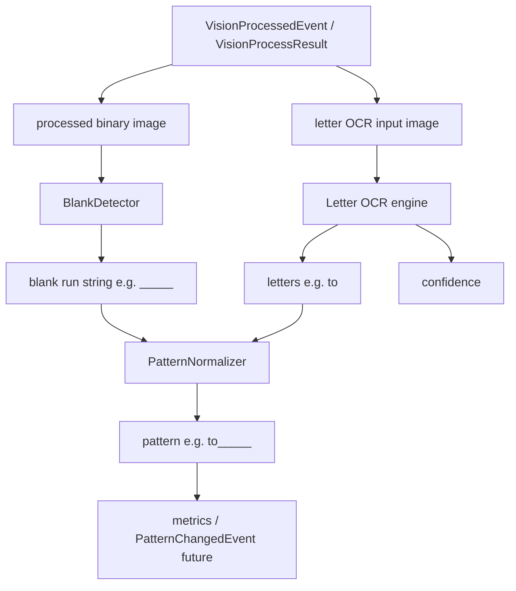

# Phase 4 — OCR & pattern recognition design

This document defines how GuessWord AI turns preprocessed vision output into a **solver-ready pattern** (`to_____`), how OCR engines are compared, and how the standalone validation tool benchmarks the **full pipeline** before event-bus integration.

## Design principles

1. **No engine decision from a single image.** Engine choice requires a labeled benchmark of **50–100 samples** (minimum bar for the study; more is better).
2. **Letters and blanks are separate concerns.** OCR reads **alphabetic characters only**. Underscore / blank slots come from **computer vision on the binary processed image**.
3. **One merge step.** `PatternNormalizer` combines OCR letters and detected blank runs into the final pattern string.
4. **One implementation path.** Production code lives under `src/ocr/`; the validation tool **imports** it and adds no duplicate engine logic.

---

## End-to-end pattern pipeline



### Letter OCR input

Engines receive an image suited for **character recognition**, not underscore detection:

- Default: **`VisionProcessResult.original_bgr`** (color preserves contrast for neural OCR), with optional config to use grayscale.
- OCR backends must use a **letter-only whitelist** (`a–z`, optionally `A–Z` normalized to lower) and must **not** treat `_` as an OCR target.

### Blank detection input

**`BlankDetector`** reads **`VisionProcessResult.processed`** only (single-channel binary after threshold + morphology).

Responsibilities:

- Segment horizontal **ink regions** (letters) vs **blank indicators** (underscores, empty slots, dash-like placeholders—defined per dataset tags).
- Output a string of `_` characters whose **count and order** match visible blank slots left-to-right in reading order.
- Output is **independent of OCR engine** so blank metrics isolate CV quality.

### PatternNormalizer

Pure function / small class with no I/O:

| Input | Example |
|--------|---------|
| `letters` | `"to"` |
| `blanks` | `"_____"` |
| Output `pattern` | `"to_____"` |

Rules:

- Lowercase letters; strip whitespace and punctuation from OCR before merge.
- Validate alphabet-only `letters` and underscore-only `blanks`.
- If OCR returns multiple letter groups (multi-line UI), normalizer applies a **layout policy** from settings (default: concatenate left-to-right top-to-bottom with no separator)—documented in API docstring.
- On mismatch (e.g. OCR `"today"` but blanks `"__"`), still produce `"today__"` for debugging; benchmark marks **pattern accuracy** down.

### PatternRecognizer (facade)

`PatternRecognizer` (name in code) orchestrates:

1. `BlankDetector.detect(processed) → BlankDetectionResult`
2. `OCREngine.recognize_letters(ocr_image) → LetterOCRResult`
3. `PatternNormalizer.merge(letters, blanks) → PatternResult`

`PatternResult` (production type):

- `pattern: str`
- `letters: str`
- `blanks: str`
- `confidence: float` (from letter OCR; blank detector may expose `blank_confidence` later)
- `recognition_score: float` (see metrics below)

This type replaces the older idea of OCR returning a full pattern directly. `OCRProvider` in `provider.py` will be refactored in Phase 4 to **`LetterOCREngine`** protocol; event bus still publishes `{pattern, confidence}` via `PatternChangedEvent`.

---

## Module layout (`src/ocr/`)

```
src/ocr/
├── __init__.py
├── provider.py              # LetterOCREngine protocol, LetterOCRResult, PatternResult
├── blank_detector.py        # CV on processed binary
├── pattern_normalizer.py    # merge letters + blanks
├── pattern_recognizer.py    # full pipeline facade
├── types.py                 # shared dataclasses if needed
└── engines/
    ├── __init__.py
    ├── base.py              # optional ABC / shared helpers (whitelist, timing hooks)
    ├── paddle.py
    ├── easyocr.py
    └── tesseract.py         # skips gracefully when binary missing
```

| Component | Must not |
|-----------|----------|
| `engines/*` | Screen capture, event bus, blank detection |
| `blank_detector` | Call OCR or solver |
| `pattern_normalizer` | OpenCV / ML |
| `pattern_recognizer` | Dictionary lookup |

---

## Benchmark dataset format

Location (convention):

```
benchmarks/ocr_dataset/
├── dataset.json          # manifest (required)
└── images/               # PNG samples referenced by manifest
    ├── 0001.png
    └── ...
```

### `dataset.json` schema (version 1)

```json
{
  "version": 1,
  "name": "guessword-ocr-v1",
  "description": "Labeled word-strip crops for pattern pipeline benchmark",
  "samples": [
    {
      "id": "0001",
      "image": "images/0001.png",
      "expected_letters": "to",
      "expected_blanks": "_____",
      "expected_pattern": "to_____",
      "tags": ["synthetic", "gray_background"],
      "notes": "Optional free text"
    }
  ]
}
```

Field rules:

- **`expected_pattern`** must equal `expected_letters + expected_blanks` (validator enforces this when loading the dataset).
- **`image`** is relative to the dataset root directory.
- **`id`** is unique stable key for reports.
- **`tags`** support filtering reports (e.g. `real_capture`, `dark_theme`, `small_font`).

### Dataset size and growth

| Stage | Count | Purpose |
|-------|-------|---------|
| Seed | 1 | Existing `tests/fixtures/sample_word_strip.png` copied or linked into dataset |
| Study minimum | **50–100** | Engine comparison and go/no-go for Phase 4 integration |
| Ongoing | +N | New captures from region picker exports, synthetic generator, augmented variants |

Synthetic augmentation (future script, not Phase 4 blocker): font/color jitter on template strips to reach 50+ without manual labeling of every pixel.

The repository may ship a **small seed** manifest; contributors expand toward 50–100 before locking the default engine in config.

---

## Validation tool (imports `src/ocr/`)

Location:

```
tools/ocr_validate/
├── __main__.py
├── cli.py
├── dataset.py           # load/validate dataset.json
├── runner.py            # run PatternRecognizer × engines × samples
├── metrics.py           # aggregate letter/pattern/latency/cpu/confidence/score
└── report.py            # Markdown + JSON output
```

Constraints:

- **No** `EventBus`, **no** changes to `main.py` for benchmarking.
- Reuses **`vision.image_processor.ImageProcessor`** + **`VisionSettings`** on each sample image (same preprocessing as production).
- Instantiates **`PatternRecognizer`** with each `src/ocr/engines/*` implementation.
- Optional **`--debug-dir`**: save processed binary, blank-detector overlay, and sidecar `.txt` with letters/blanks/pattern per sample.

CLI sketch:

```bash
PYTHONPATH=src python -m tools.ocr_validate \
  --dataset benchmarks/ocr_dataset \
  --engines paddle,easyocr,tesseract \
  --report reports/ocr_benchmark.md \
  --runs 5
```

---

## Evaluation methodology

### Per sample, per engine

Run the **complete pipeline** (vision preprocess → blank detect → letter OCR → normalize).

| Metric | Definition |
|--------|------------|
| **Letter accuracy** | `1.0` if `result.letters == expected_letters`, else character-level ratio on the shorter/longer aligned prefix (report both exact-match rate and mean char accuracy). |
| **Pattern accuracy** | `1.0` if `result.pattern == expected_pattern`, else same char-level rule on full pattern. |
| **Average latency** | Mean wall-clock ms for full pipeline per sample (after warmup), including vision + recognize. |
| **CPU usage** | Mean process CPU seconds per pipeline run (`time.process_time()` delta). |
| **Confidence** | Mean of letter OCR confidence across runs (engine-native 0–1 scale). |
| **Recognition score** | Single ranking scalar per sample: `letter_accuracy × pattern_accuracy × confidence` (all in [0, 1]). Tune weights in config only if ablations show a better correlation with solver success. |

### Aggregate report (per engine)

Over all samples in the dataset:

- Mean / median **letter accuracy**, **pattern accuracy**, **recognition score**
- **Exact-match rates** (% samples with 1.0 letter / pattern accuracy)
- **p95 latency**, mean latency
- Mean CPU
- Mean confidence
- Breakdown by **`tags`** (table per tag when N ≥ 5)

### Engine selection policy

1. Implement all three engines under `src/ocr/engines/`.
2. Build dataset to **≥ 50** labeled samples.
3. Run validation tool; compare **aggregate pattern accuracy** and **p95 latency** under CPU (default `use_gpu=false`).
4. Choose default engine only when one backend **clearly wins** on pattern accuracy without violating latency budget (~100 ms OCR+CV portion of 200 ms total), or document a hybrid policy (e.g. fast CV + lighter OCR).

Document the decision in `docs/OCR_ENGINE_DECISION.md` (created after benchmark, not before).

---

## Configuration hooks (`OCRSettings`)

Existing fields remain; add when implementing:

| Field | Purpose |
|-------|---------|
| `engine` | `paddle` \| `easyocr` \| `tesseract` |
| `letter_image_source` | `original` \| `grayscale` |
| `min_confidence` | Filter low-confidence letter OCR before publishing event |

Blank detector parameters may live under `ocr` or `vision` depending on coupling; prefer **`OCRSettings`** if tuning is pattern-specific.

---

## Testing strategy

| Layer | Tests |
|-------|--------|
| `pattern_normalizer` | Unit tests, no images |
| `blank_detector` | Fixture binary arrays + dataset samples |
| `engines/*` | Optional `@pytest.mark.ocr` integration tests |
| `pattern_recognizer` | Mock letter engine + real blank detector on fixtures |
| `tools/ocr_validate` | Dataset loader validation, metric math on synthetic results |

CI runs fast tests only; full engine benchmark is manual or scheduled workflow with cached models.

---

## Phase 4 integration (after validation)

When benchmark sign-off completes:

1. Wire **`PatternRecognizer`** into a new **`OCRStage`** subscribing to **`VisionProcessedEvent`**.
2. Publish **`PatternChangedEvent`** with `pattern` and `confidence` (from letter OCR or composite score—document choice).
3. Do **not** subscribe OCR to raw `FrameChangedEvent`.

Until then, only `tools/ocr_validate` and unit tests exercise OCR code paths.
